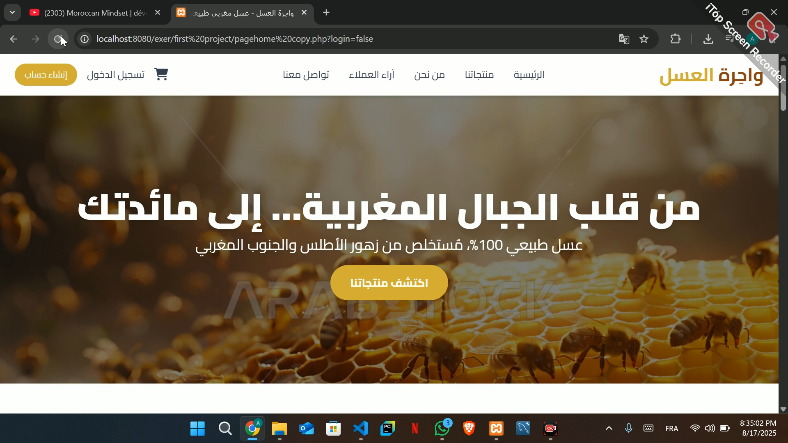
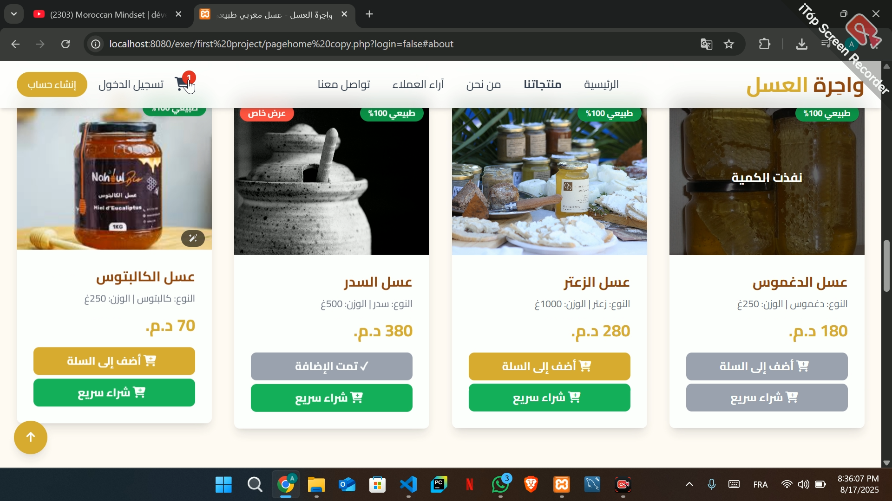
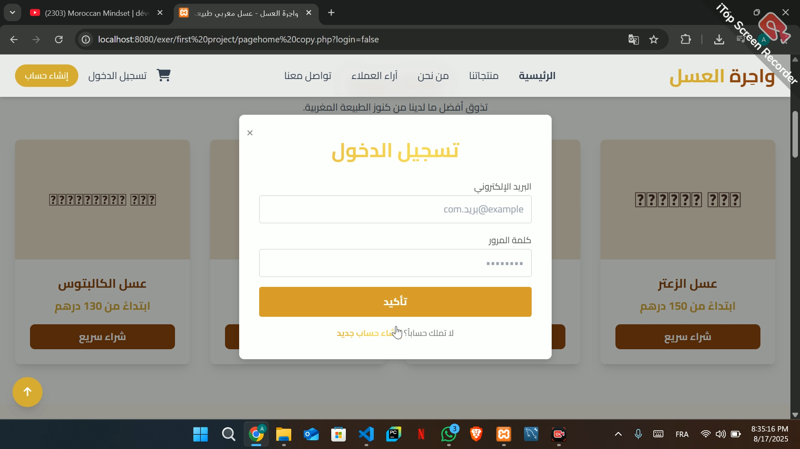

# HoneyStore – Full Stack Project (React + Laravel)

🚧 Concept Project

This repository showcases the concept and design idea of a Full Stack e-commerce project.
The final version will be built using React and Laravel.

## Tech Stack (Planned)
- Frontend: React JS
- Backend: Laravel
- Database: MySQL
- Animations: Framer Motion

## Screenshots (Concept)

## Status
Currently under planning and development.
Full Stack implementation coming soon.
